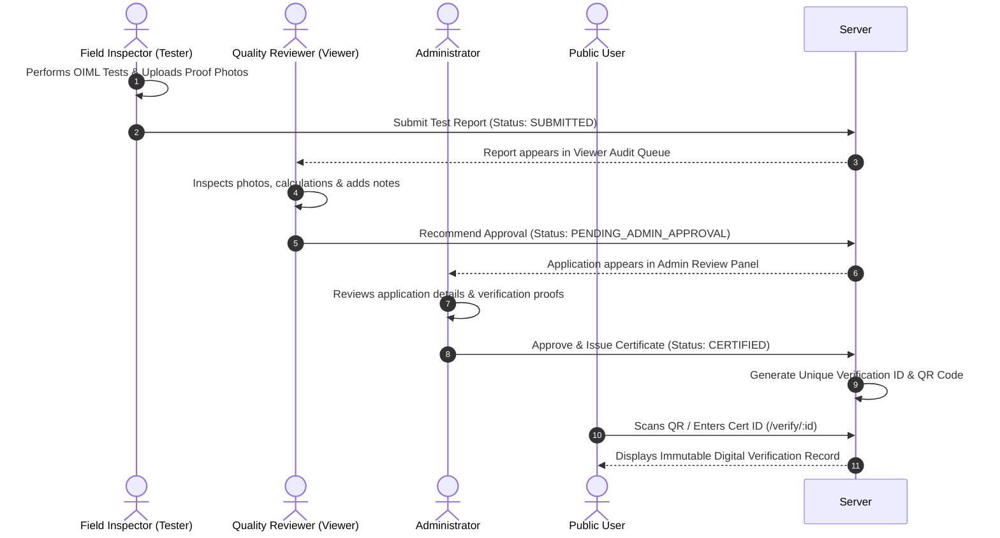

# 📜 Project Technical Report: NAWI Testing & Certification Platform

---

## 1. Executive Summary

The **NAWI (Non-Automatic Weighing Instrument) Testing & Certification Platform** is an enterprise-grade MERN stack web application built for Legal Metrology inspectors, quality reviewers, and legal authorities. It automates field testing, metrological error calculations, compliance verification, inspection report workflow, and digital certificate issuance according to international **OIML R76-1 (2006)** standards.

---

## 2. Project Architecture & Technical Stack

```
+-----------------------------------------------------------------------+
|                             CLIENT (Vite + React 19)                  |
|  - Role-Based Views: Tester / Viewer / Admin                          |
|  - OIML R76-1 Real-time Calculation Engine (r76engine.js)             |
|  - Dynamic Design System (Precision Royal Blue #2563EB / Slate)       |
+-----------------------------------------------------------------------+
                                   |
                         HTTPS REST API / JSON
                                   v
+-----------------------------------------------------------------------+
|                           SERVER (Node.js + Express)                  |
|  - JWT Authentication (Access Token + Refresh Token Cookies)          |
|  - Role-Based Access Control Middleware (RBAC)                        |
|  - Cloudinary Image Proof Service                                     |
+-----------------------------------------------------------------------+
                                   |
                                   v
+-----------------------------------------------------------------------+
|                             DATABASE (MongoDB)                        |
|  - Collections: Users, Reports, Rulesets                              |
+-----------------------------------------------------------------------+
```

### Tech Stack Details

- **Frontend**: React 19, Vite, React Router v7, Tailwind CSS + Custom Design Tokens, QRCode.react, FontAwesome & Lucide Icons.
- **Backend**: Node.js, Express.js, JWT (`jsonwebtoken`), `bcryptjs`, Cookie-Parser, CORS, Cloudinary SDK.
- **Database**: MongoDB (Mongoose ODM).
- **Deployment**:
  - **Frontend**: Vercel (Global Edge CDN with reverse proxy rewrites).
  - **Backend**: Render Web Service (Node.js 20).
  - **Containerization**: Multi-stage Docker build.

---

## 3. Metrological Engine & OIML R76-1 Compliance

The platform implements the mathematical verification rules specified under **OIML R76-1:2006** for non-automatic weighing instruments across Class I, II, III, and IIII.

### Key Calculation Formulas

1. **True Load ($L$) & Indication ($I$)**:
   $$\text{Indication Error } E = I - L$$

2. **Corrected Error ($E_c$) with Changeover Weight ($\Delta L$) & Verification Scale Interval ($e$)**:
   $$E_c = I + \frac{1}{2}e - \Delta L - L - E_0$$
   *where $E_0$ is the zero-load error.*

3. **Maximum Permissible Error (MPE) Tiers**:
   - **Tier 1 ($0 \le m \le 500e$)**: $\text{MPE} = \pm 0.5e$
   - **Tier 2 ($500e < m \le 2000e$)**: $\text{MPE} = \pm 1.0e$
   - **Tier 3 ($m > 2000e$)**: $\text{MPE} = \pm 1.5e$

### Supported Metrological Tests

- **Weighing Performance Test**: Ascending and descending load errors evaluated against MPE limits.
- **Repeatability Test**: Standard deviation and maximum difference across repeated loads at $50\%$ and $100\%$ Max.
- **Eccentricity (Corner Load) Test**: Corner load variances evaluated at $\frac{1}{3} \text{Max}$.
- **Discrimination Test**: Sensitivity evaluation under extra small load additions.
- **Tare & Net Test**: Net indication accuracy check across operating tare ranges.
- **Creep & Warm-up Tests**: Time-dependent zero/load drift evaluations.

---

## 4. System Workflow & Role-Based Control (RBAC)



---

## 5. Security & Authentication Model

- **Dual-Token System**:
  - **Short-lived Access Token** (15 mins) transmitted in Authorization headers.
  - **Long-lived Refresh Token** (7 days) stored in HttpOnly, SameSite, Secure cookies.
- **Password Security**: Salted hashing via `bcryptjs`.
- **CORS & Rate Limiting**: Dynamic Origin reflection and window-based IP rate limits.

---

## 6. Design System & User Interface

- **Unified Color Palette**:
  - Brand Primary: `Precision Royal Blue (#2563EB)`
  - Accent / Metrology: `Teal (#0D9488)`
  - Ink & Background: `Slate Ink (#0F172A)` / `Paper (#F8FAFC)`
- **Standardized Heading System**: Uniform typography hierarchy (`h1` through `h6`) with explicit font sizes, weights, and line heights.

---

## 7. Production Verification & Test Results

- **Vite Build Bundle**:
  - **Status**: Clean Build (0 errors)
  - **Modules**: 48 modules transformed
  - **Artifact Bundle Size**: `index-*.js` ~270 kB (Gzipped: ~85 kB)
- **Unit Test Suite**: `r76engine.test.js` covering all OIML R76-1 worked examples passing cleanly.

---

## 8. Deployment Infrastructure

- **GitHub Repository**: [`https://github.com/Gaurav-0301/NAWI.git`](https://github.com/Gaurav-0301/NAWI.git)
- **Backend (Render)**: [`https://nawi-x1qw.onrender.com`](https://nawi-x1qw.onrender.com)
- **Frontend (Vercel)**: Deployed with reverse proxy rewrites to Render backend via [`vercel.json`](file:///c:/Users/Lenovo/OneDrive/Desktop/NAWI/vercel.json).
